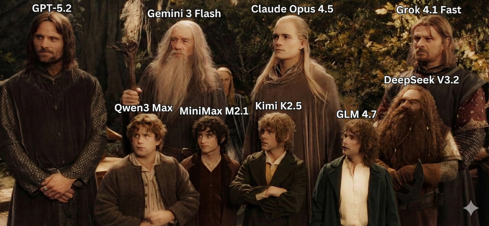

# 🏔️ Council of Elrond (Bot Consensus)


[](https://github.com/talhaorak/council-of-elrond/actions/workflows/ci.yml) 
[](buymeacoffee.com/talhao)

<p align="center">
  
  <br/>
  <em>"Nine companions... so be it. You shall be the Fellowship of the Ring." — But with LLMs!</em>
</p>

A sophisticated multi-agent AI consensus system where LLM-powered agents with distinct personalities discuss topics, challenge ideas, raise structured objections, and work toward consensus through a carefully designed protocol.

> **"Strangers from distant lands, friends of old. You have been summoned here to answer the threat of Mordor..."**
> 
> Like the legendary council that decided the fate of Middle-earth, this tool brings together diverse AI perspectives to deliberate on complex decisions.

## Table of Contents

- [Features](#features)
- [Installation](#installation)
- [Quick Start](#quick-start)
- [Usage Modes](#usage-modes)
- [Keyboard Controls](#keyboard-controls)
- [Configuration](#configuration)
- [Personality System](#personality-system)
- [Discussion Protocol](#discussion-protocol)
- [Advanced Features](#advanced-features)
  - [Cost Tracking](#cost-tracking)
  - [BLOCKER Schema](#blocker-schema)
  - [Structured State](#structured-state)
  - [Arbiter System](#arbiter-system)
  - [Abort Conditions](#abort-conditions)
  - [Decision Gates](#decision-gates)
- [Workspace Management](#workspace-management)
- [Programmatic API](#programmatic-api)
- [AI Agent Integration](#ai-agent-integration)
- [Provider Setup](#provider-setup)
- [CLI Reference](#cli-reference)
- [Architecture](#architecture)
- [Output Format](#output-format)
- [Troubleshooting](#troubleshooting)
- [License](#license)

## Features

### Core Features

- **Multi-Provider Support**: OpenAI, Anthropic, Google (Gemini), Ollama, LM Studio, OpenRouter (100+ models)
- **8 Personality Archetypes**: skeptic, optimist, pessimist, pragmatist, innovator, devils-advocate, analyst, mediator
- **Custom Personalities**: Create your own or extend existing archetypes with custom traits
- **Structured Protocol**: Turn-based discussion with Opening → Discussion → Synthesis → Consensus phases
- **Moderator Agent**: AI-powered moderator guides discussion, summarizes rounds, identifies agreements/disagreements
- **Multiple Interfaces**:
  - **CLI**: Headless mode for scripting and automation
  - **TUI**: Interactive terminal UI with real-time streaming and wizard
  - **Web UI**: Beautiful browser-based interface with real-time updates

### Session & Output

- **Session Management**: Save, continue, and export discussions
- **Auto-Save**: Automatic state persistence after each agent response
- **Workspace Support**: Organize sessions and configs in project-specific directories
- **Markdown Export**: Beautiful output with summary, metrics, cost breakdown, and full transcript
- **Resume Capability**: Continue interrupted sessions from where they left off

### Control & Monitoring

- **Interrupt Controls**: Soft interrupt (wrap up gracefully), hard interrupt (stop immediately), skip agent
- **Verbose Toggle**: Switch between full streaming output and summary-only mode
- **Real-time Cost Tracking**: Monitor API costs as the discussion progresses
- **Debug Logging**: Comprehensive file-based logging for troubleshooting
- **"Thinking" Indicators**: Visual feedback when agents are processing

### Advanced Protocol Features

- **BLOCKER Schema**: Structured objection format with severity and confidence levels
- **Decision Gates**: Quality metrics with GO/NO-GO/EXPAND/NEEDS-HUMAN recommendations
- **Arbiter System**: Automatic tie-breaking for deadlocked discussions
- **Hard Limits**: Configurable cost, time, and token limits with auto-abort
- **Human Decision Gate (Optional)**: Pause on critical blockers and continue with a human decision
- **Consensus Metrics**: Agreement level tracking and convergence detection

### Integration

- **AI Tool Integration**: Clean JSON API for other AI agents to use
- **SKILL.md Specification**: Full agent skills documentation for AI interoperability
- **Secure API Key Storage**: Local workspace or global (~/.consensus/) key storage

## Installation

### Quick Install (npm)

```bash
# Install globally
npm install -g council-of-elrond

# Or run directly with npx (no install needed)
npx council-of-elrond --wizard
```

### From Source

**Prerequisites:**
- [Bun](https://bun.sh/) runtime (v1.0+)
- At least one LLM provider (local or cloud)

```bash
# Clone the repository
git clone https://github.com/talhaorak/council-of-elrond.git
cd council-of-elrond

# Install dependencies
bun install

# (Optional) Set up environment variables
cp .env.example .env
```

### Verify Installation

```bash
# Check available providers
bun run src/cli.ts providers

# List personality archetypes
bun run src/cli.ts personalities
```

## Quick Start

### 1. Interactive Wizard (Recommended for First-Time Users)

```bash
bun run src/cli.ts --wizard
```

The wizard guides you through:
1. Setting your discussion topic
2. Choosing discussion depth (number of rounds)
3. Selecting provider and model
4. Adding agents with personalities
5. Configuring output options

### 2. Web Interface

```bash
# Start the web server
bun run src/cli.ts --web

# Open http://localhost:3000
```

The web UI provides:
- Step-by-step wizard for configuration
- Real-time streaming of agent responses
- Cost and metrics dashboard
- Blocker visualization
- Decision gate status

### 3. Direct Command Line

```bash
# Quick discussion with default settings (uses LM Studio)
bun run src/cli.ts run \
  --topic "Best practices for REST API design in Go" \
  --agent skeptic \
  --agent pragmatist \
  --agent innovator \
  --depth 3

# With specific provider and model
bun run src/cli.ts run \
  --topic "Microservices vs Monolith" \
  --agent openrouter:anthropic/claude-sonnet-4:skeptic \
  --agent openrouter:openai/gpt-4o:optimist \
  --output discussion.md

# With cost limits
bun run src/cli.ts run \
  --topic "Database selection" \
  --agent skeptic --agent pragmatist \
  --max-cost 2.00 \
  --max-time 5
```

### 4. Using a Config File

```bash
# Generate sample config
bun run src/cli.ts init

# Edit consensus.yaml to your needs

# Run with config
bun run src/cli.ts run -c consensus.yaml
```

## Usage Modes

### Headless Mode (Default)
Best for scripting, automation, CI/CD pipelines, and integration with other tools.

```bash
bun run src/cli.ts run --topic "Your topic" --agent skeptic --agent pragmatist --stdout
```

Features:
- Non-interactive execution
- Machine-readable JSON output with `--json`
- Human-readable summary output with `--stdout`
- Full interrupt support via signals
- Automatic session saving

### Interactive Wizard Mode
Best for first-time users, exploratory discussions, and complex configurations.

```bash
bun run src/cli.ts --wizard
```

Features:
- Step-by-step configuration
- Provider and model selection
- Personality browsing and selection
- Pre-configured team templates
- Session resume detection

### TUI Mode
Terminal UI with real-time updates, best for developers who prefer the terminal.

```bash
bun run src/cli.ts --tui --topic "Your topic" --agent skeptic --agent optimist
```

Features:
- Real-time streaming display
- Keyboard controls for interrupts
- Verbose toggle
- Progress indicators

### Web UI Mode
Browser-based interface with real-time streaming, best for presentations and collaborative sessions.

```bash
bun run src/cli.ts --web --port 3000 --workspace ./my-project
```

Features:
- Beautiful responsive design
- Real-time SSE streaming
- Cost and metrics dashboard
- Blocker and decision gate visualization
- Provider configuration with API key management
- Model selection with grouping by provider
- Limits & safeguards step (cost/time/token/blocker caps)
- Human decision input when critical blockers require review

## Keyboard Controls

During an interactive discussion (TUI, Wizard, or Web):

| Key | Action | Description |
|-----|--------|-------------|
| `v` | Toggle Verbose | Switch between full streaming output and summary-only mode |
| `s` | Soft Interrupt | Tell agents to wrap up → Skip to synthesis → Generate consensus |
| `p` / `Space` | Skip Agent | Pass current agent's turn (useful if agent is stuck) |
| `q` | Quit | Stop immediately, save current state |
| `Ctrl+C` | Hard Interrupt | Emergency stop, save what we have |
| `h` | Help | Show keyboard controls |

### Verbose vs Quiet Mode

- **Verbose Mode (default)**: Shows full streaming response from each agent in real-time
- **Quiet Mode**: Shows only agent names, stances, and key points (faster to scan)

Press `v` at any time to toggle between modes.

## Configuration

### Environment Variables

Create a `.env` file in your project root:

```bash
# API Keys (store securely!)
OPENAI_API_KEY=sk-...
ANTHROPIC_API_KEY=sk-ant-...
GOOGLE_API_KEY=...
OPENROUTER_API_KEY=sk-or-...

# Local LLM endpoints
OLLAMA_BASE_URL=http://localhost:11434
LMSTUDIO_BASE_URL=http://localhost:1234

# Defaults
DEFAULT_PROVIDER=lmstudio
DEFAULT_MODEL=qwen/qwen3-coder-30b

# Web UI
WEB_PORT=3000

# Debug mode
CONSENSUS_DEBUG=true
```

### Config File (consensus.yaml)

Full configuration example:

```yaml
topic: "The most feasible and performant REST API architecture for Go applications"
depth: 3  # Number of discussion rounds

# Provider defaults
defaults:
  provider: openrouter
  model: anthropic/claude-sonnet-4
  temperature: 0.7

# Moderator configuration
moderator:
  provider: openrouter
  model: anthropic/claude-sonnet-4
  temperature: 0.5

# Optional: Arbiter for deadlock resolution
arbiter:
  provider: openrouter
  model: openai/gpt-4o

# Resource limits
limits:
  maxCostUsd: 5.00      # Maximum total cost
  maxDurationMs: 600000 # 10 minutes
  maxTokens: 100000     # Maximum total tokens
  maxBlockers: 20       # Max unresolved blockers before abort
  maxConsecutiveDisagreements: 3  # Triggers arbitration
  requireHumanDecision: false     # Optional: pause on critical blockers

# Agent definitions
agents:
  - name: "The Pragmatist"
    provider: openrouter
    model: anthropic/claude-sonnet-4
    personality: pragmatist
    
  - name: "The Innovator"
    provider: openrouter
    model: openai/gpt-4o
    personality: innovator
    
  - name: "The Skeptic"
    provider: lmstudio
    model: qwen/qwen3-coder-30b
    personality: skeptic
    
  # Custom personality example
  - name: "Go Expert"
    provider: openrouter
    model: deepseek/deepseek-chat
    personality:
      base: analyst
      name: "Go Architecture Expert"
      description: "Deep expertise in Go and distributed systems"
      systemPromptAddition: |
        You have 15 years of experience building high-scale Go applications.
        Reference specific Go patterns, libraries (gin, echo, fiber, etc.).
        Provide concrete performance considerations and benchmarks.
      traits:
        - name: expertise
          description: Extensive knowledge of Go ecosystem
          weight: 0.9
        - name: practical
          description: Focus on real-world implementation
          weight: 0.8
      communicationStyle:
        tone: authoritative but approachable
        verbosity: detailed
        formality: balanced

# Output configuration
output:
  path: ./discussions/consensus-output.md
  includeTranscript: true
  includeCostBreakdown: true
```

Generate a sample config:

```bash
bun run src/cli.ts init -o my-config.yaml
```

## Team Templates

Pre-configured teams for different use cases. Use `--team <name>` to quickly start with a balanced configuration.

### 🏔️ Council of Elrond
*"Nine companions... so be it."*

Inspired by Tolkien's legendary council. Each LLM embodies a character from the Fellowship:

| Character | Model | Personality | Role |
|-----------|-------|-------------|------|
| **Gandalf** | Claude Opus | Analyst | Ancient wisdom, strategic vision |
| **Elrond** | GPT-5.2 Pro | Mediator | Historical perspective, diplomacy |
| **Aragorn** | Gemini 3 Pro | Pragmatist | Practical wisdom, humble leadership |
| **Legolas** | Grok 4.1 | Analyst | Keen perception, swift assessment |
| **Gimli** | DeepSeek R1 | Skeptic | Dwarven stubbornness, demands proof |
| **Boromir** | Kimi K2.5 | Devil's Advocate | Argues for expedient solutions |
| **Frodo** | Claude Sonnet | Mediator | Simple truths, compassion |

```bash
consensus run --team council-of-elrond --topic "Should we take the Ring to Mordor?"
```

### 🆓 Free Council
Zero-cost team using free OpenRouter models. Perfect for testing and learning.

| Agent | Model | Personality |
|-------|-------|-------------|
| DeepThinker | deepseek/deepseek-chat:free | Analyst |
| LlamaWise | meta-llama/llama-3.1-8b:free | Pragmatist |
| GemmaSkeptic | google/gemma-2-9b-it:free | Skeptic |
| MistralCreative | mistralai/mistral-7b:free | Innovator |

```bash
consensus run --team free-council --topic "Your topic here"
```

### 👑 Pro Council
Elite team with the most powerful reasoning models. For critical decisions.

| Agent | Model | Personality |
|-------|-------|-------------|
| Claude Opus | anthropic/claude-4.5-opus | Analyst |
| GPT-5.2 Pro | openai/gpt-5.2-pro | Pragmatist |
| Gemini 3 Pro | google/gemini-3-pro | Innovator |
| Grok Reasoner | x-ai/grok-4.1 | Devil's Advocate |
| DeepSeek R1 | deepseek/deepseek-r1 | Skeptic |
| O3 Planner | openai/o3 | Mediator |

```bash
consensus run --team pro-council --topic "Critical business decision"
```

### 🏠 Local Council
Runs entirely on local hardware (LM Studio / Ollama). Zero API costs, complete privacy.

| Agent | Model | Personality |
|-------|-------|-------------|
| Qwen Coder | qwen/qwen3-coder-30b | Analyst |
| Llama Pragmatist | llama3.3:70b | Pragmatist |
| DeepSeek Local | deepseek-r1:14b | Skeptic |
| Mistral Creative | mixtral:8x22b | Innovator |

```bash
consensus run --team local-council --topic "Private discussion"
```

### Custom Teams

Create your own team in `templates/teams/my-team.yaml`:

```yaml
name: My Custom Team
description: A team optimized for my use case
agents:
  - name: Expert One
    provider: openrouter
    model: anthropic/claude-sonnet-4.5
    personality:
      base: analyst
      systemPromptAddition: |
        You are an expert in...
```

## Personality System

### Built-in Archetypes

| Archetype | Description | Best For |
|-----------|-------------|----------|
| `skeptic` | Questions assumptions, demands evidence, looks for flaws | Testing ideas rigorously |
| `optimist` | Sees potential, focuses on solutions, encourages ideas | Encouragement, possibilities |
| `pessimist` | Identifies risks, prepares for worst cases, cautious | Risk assessment |
| `pragmatist` | Focuses on practical implementation, feasibility | Grounding discussions |
| `innovator` | Proposes creative and novel solutions | Brainstorming, new ideas |
| `devils-advocate` | Argues opposite positions, stress-tests consensus | Breaking groupthink |
| `analyst` | Systematic, data-driven, methodical analysis | Technical decisions |
| `mediator` | Bridges differences, finds common ground | Resolving disagreements |

### Suggested Teams

| Team | Agents | Best For |
|------|--------|----------|
| **Balanced** | pragmatist, innovator, skeptic, analyst | General technical discussions |
| **Creative** | innovator, optimist, devils-advocate, mediator | Brainstorming, ideation |
| **Critical** | skeptic, pessimist, analyst, pragmatist | Risk assessment, due diligence |
| **Minimal** | optimist, skeptic | Quick discussions, rapid feedback |
| **Comprehensive** | All 6 core types | Thorough analysis, important decisions |

### Custom Personalities

Create a YAML file with your custom personality:

```yaml
# my-expert.yaml
name: Cloud Architecture Expert
description: Deep expertise in cloud-native architecture and distributed systems

base: analyst  # Optional: inherit from existing archetype

traits:
  - name: cloud_expertise
    description: Extensive knowledge of AWS, GCP, and Azure
    weight: 0.9
  - name: cost_conscious
    description: Always considers cost implications
    weight: 0.8
  - name: security_focused
    description: Security-first mindset
    weight: 0.7

systemPromptAddition: |
  You are a cloud architecture expert with 15 years of experience.
  You've designed systems handling millions of requests per second.
  
  When discussing architecture:
  - Always reference specific cloud services and their trade-offs
  - Provide concrete cost estimates when possible
  - Consider security implications of every design decision
  - Reference real-world case studies and war stories

communicationStyle:
  tone: authoritative but approachable
  verbosity: detailed
  formality: balanced
```

Use in config:

```yaml
agents:
  - name: "Cloud Expert"
    personality: ./my-expert.yaml
```

## Discussion Protocol

```
┌──────────────────────────────────────────────────────────────┐
│  PHASE 1: OPENING                                            │
│  • Moderator introduces topic and participants               │
│  • Each agent shares initial position                        │
│  • Agents may raise initial BLOCKERs                         │
│  • Sets the foundation for discussion                        │
│  • Cost tracking begins                                      │
└──────────────────────────────────────────────────────────────┘
                              ↓
┌──────────────────────────────────────────────────────────────┐
│  PHASE 2: DISCUSSION (multiple rounds)                       │
│  For each round:                                             │
│  • Agents respond with: AGREE, DISAGREE, REFINE, CHALLENGE   │
│  • Agents can raise structured BLOCKERs                      │
│  • Moderator summarizes after each round                     │
│  • System tracks agreements, disagreements, blockers         │
│  • Decision gate evaluated at end of round                   │
│  • Arbiter invoked if deadlock detected                      │
│  • Auto-save after each agent response                       │
└──────────────────────────────────────────────────────────────┘
                              ↓
┌──────────────────────────────────────────────────────────────┐
│  PHASE 3: SYNTHESIS                                          │
│  • Agents propose merged/improved solutions                  │
│  • Focus on resolving open blockers                          │
│  • Bridge remaining disagreements                            │
│  • Work toward actionable outcomes                           │
└──────────────────────────────────────────────────────────────┘
                              ↓
┌──────────────────────────────────────────────────────────────┐
│  PHASE 4: CONSENSUS                                          │
│  • Moderator drafts final consensus statement                │
│  • Key agreements documented                                 │
│  • Remaining disagreements noted                             │
│  • Open blockers summarized with mitigations                 │
│  • Final decision gate: GO / NO-GO / NEEDS-HUMAN             │
│  • Cost summary generated                                    │
└──────────────────────────────────────────────────────────────┘
```

### Agent Response Format

Agents structure their responses with markers:

```
[STANCE: REFINE]

I'd like to build on the pragmatist's point about API versioning...

[BLOCKER: condition="API version mismatches during rolling deployments" | impact="Clients receive incompatible responses causing crashes" | detection="Monitor for 4xx errors during deployments" | mitigation="Implement graceful version negotiation and feature flags" | severity=4 | confidence=4]

[KEY_POINTS: API versioning is crucial for maintainability | Consider semantic versioning | Feature flags provide flexibility]
```

## Advanced Features

### Cost Tracking

Bot Consensus tracks estimated API costs in real-time:

- **Per-agent costs**: See which agents consume the most tokens
- **Per-phase costs**: Understand cost distribution across discussion phases
- **Per-round costs**: Track how costs grow over rounds
- **Total tracking**: Running total with limit checking

Pricing is estimated based on current (Feb 2026) provider rates:

| Provider | Model | Input (per 1M) | Output (per 1M) |
|----------|-------|----------------|-----------------|
| OpenAI | GPT-4o | $2.50 | $10.00 |
| Anthropic | Claude Sonnet 4 | $3.00 | $15.00 |
| Google | Gemini 2.5 Pro | $1.25 | $5.00 |
| DeepSeek | DeepSeek V3 | $0.14 | $0.28 |
| xAI | Grok 3 | $3.00 | $10.00 |

Set cost limits via CLI:

```bash
bun run src/cli.ts run --topic "..." --agent skeptic --max-cost 2.00
```

Or in config:

```yaml
limits:
  maxCostUsd: 5.00
```

### BLOCKER Schema

Agents can raise structured objections using the BLOCKER format:

```
[BLOCKER: condition="<when this issue occurs>" | impact="<what breaks or goes wrong>" | detection="<how to notice the issue>" | mitigation="<concrete action to address>" | severity=<1-5> | confidence=<1-5>]
```

**Severity Levels:**
| Level | Meaning | Action |
|-------|---------|--------|
| 1-2 | Minor concerns | Can proceed, note for later |
| 3 | Moderate concern | Should address before finalizing |
| 4-5 | Critical concern | Must resolve before proceeding |

**Confidence Levels:**
| Level | Meaning | Action |
|-------|---------|--------|
| 1-2 | Speculation | Needs validation |
| 3 | Reasonable belief | Based on experience |
| 4-5 | High certainty | Based on evidence |

Blockers with severity ≥4 and confidence ≥4 are considered **critical** and may trigger:
- Arbiter intervention
- NEEDS-HUMAN decision gate (and optional pause when `requireHumanDecision` is enabled)
- Auto-abort (if maxBlockers exceeded)

### Structured State

Instead of passing full transcripts (expensive!), Bot Consensus maintains a structured JSON state:

```typescript
interface StructuredState {
  problem: string;
  constraints: string[];
  options: DiscussionOption[];  // Proposals with pros/cons/votes
  openQuestions: string[];
  decisions: Decision[];
  blockers: Blocker[];
  consensusLevel: number;  // 0-100%
}
```

This enables:
- **Efficient context**: Agents receive compact state, not full history
- **Vote tracking**: See which agents support which options
- **Progress measurement**: Consensus level calculated automatically
- **Better summaries**: Moderator has structured data to summarize

### Arbiter System

When discussions get stuck, the Arbiter can break deadlocks:

**Triggers:**
- Critical blockers remain unresolved after multiple rounds
- Options are deadlocked (equal support)
- Consecutive disagreements exceed threshold
- Consensus level stays below 30% with no progress

**How it works:**
1. Arbiter reviews the blocker/deadlock context
2. Makes one-shot decision: ACCEPT, REJECT, or MERGE
3. Decision is binding and recorded
4. Discussion continues with resolution applied

Configure arbiter in config:

```yaml
arbiter:
  provider: openrouter
  model: openai/o1-preview  # Use a strong reasoning model
```

### Abort Conditions

Protect against runaway costs and time with hard limits:

```yaml
limits:
  maxCostUsd: 5.00           # Stop if cost exceeds $5
  maxDurationMs: 600000      # Stop after 10 minutes
  maxTokens: 100000          # Stop after 100k tokens
  maxBlockers: 20            # Stop if 20+ blockers unresolved
  maxConsecutiveDisagreements: 3  # Trigger arbitration
  requireHumanDecision: false     # Optional: pause on critical blockers
```

When a limit is hit:
1. `abort` event emitted with reason
2. Current state is saved
3. Session can be resumed later
4. Output includes abort reason

If `requireHumanDecision: true` and critical blockers are raised, the session pauses
with a `needs_human` abort reason. Provide a human decision (CLI or Web UI) to continue.

### Decision Gates

At the end of each round (and final), a decision gate is calculated:

| Gate | Condition | Recommendation |
|------|-----------|----------------|
| **GO** | Agreement ≥70%, within budget, no critical blockers | Proceed with consensus |
| **NO-GO** | Agreement ≤45% OR over budget | Reconsider approach |
| **EXPAND** | Agreement 46-69% OR unresolved questions | More discussion needed |
| **NEEDS-HUMAN** | Critical blockers present | Human decision required |

Decision gates are:
- Displayed in Web UI
- Included in markdown output
- Emitted as events for programmatic use

## Workspace Management

Bot Consensus supports workspace-based organization:

```bash
# Create workspace for a project
mkdir my-project-discussions
cd my-project-discussions

# Run with workspace
bun run src/cli.ts --web --workspace .

# Or specify path
bun run src/cli.ts run --workspace ./my-project --topic "..."
```

### Workspace Structure

```
my-project/
└── .consensus/
    ├── config.json         # Discussion configuration
    ├── keys.json           # Local API keys (gitignore this!)
    ├── current-state.json  # Auto-saved session state
    └── logs/
        └── consensus-2024-02-04.log  # Debug logs
```

### API Key Storage

API keys can be stored:

1. **Environment variables** (recommended for CI/CD)
2. **Workspace-local** (`.consensus/keys.json`)
3. **Global** (`~/.consensus/keys.json`)

Set keys via Web UI or CLI:

```bash
# Keys are auto-detected from:
# - Environment variables
# - Claude Code CLI (~/.claude.json)
# - OpenAI Codex CLI

# Or set manually in Web UI provider configuration
```

### Session Resume

If a session is interrupted:

```bash
# Wizard will detect incomplete session
bun run src/cli.ts --wizard
# → "Incomplete session detected. Resume or start fresh?"

# Or continue explicitly
bun run src/cli.ts run --continue <session-id>

# List saved sessions
bun run src/cli.ts sessions
```

## Programmatic API

### Simple API (Recommended)

```typescript
import { runConsensus, quickConsensus, balancedConsensus } from 'bot-consensus';

// Quick 2-agent discussion
const result = await quickConsensus('Should we use GraphQL or REST?');
console.log(result.consensus);
console.log(result.costSummary);  // { totalCost: 0.0234, totalTokens: 1523 }

// Balanced 4-agent team
const result = await balancedConsensus('Best database for our use case', {
  depth: 3,
  limits: { maxCostUsd: 2.0 },
});

// Full control
const result = await runConsensus({
  topic: 'Microservices architecture patterns',
  agents: [
    { provider: 'openrouter', model: 'anthropic/claude-sonnet-4', personality: 'skeptic' },
    { provider: 'openrouter', model: 'openai/gpt-4o', personality: 'pragmatist' },
    { provider: 'lmstudio', model: 'qwen/qwen3-coder-30b', personality: 'innovator' },
  ],
  depth: 3,
  limits: {
    maxCostUsd: 5.0,
    maxDurationMs: 300000,  // 5 minutes
  },
  onEvent: (event) => {
    switch (event.type) {
      case 'agent_message_chunk':
        process.stdout.write(event.content);
        break;
      case 'cost_update':
        console.log(`Cost: $${event.totalCost.toFixed(4)}`);
        break;
      case 'blocker_raised':
        console.log(`⚠️ Blocker: ${event.blocker.condition}`);
        break;
      case 'decision_gate':
        console.log(`Gate: ${event.gate.condition}`);
        break;
    }
  },
});

console.log(result.consensus);
console.log(result.keyAgreements);
console.log(result.blockers);  // Open blockers
console.log(result.metrics);   // { agreementLevel: 0.85, ... }
console.log(result.markdown);  // Full markdown output
```

### JSON Output for AI Tools

```typescript
import { runConsensusJSON } from 'bot-consensus';

const result = await runConsensusJSON({
  topic: 'API design patterns',
  agents: [
    { personality: 'skeptic' },
    { personality: 'pragmatist' },
  ],
  depth: 2,
});

// Clean JSON result:
// {
//   success: true,
//   sessionId: "abc123",
//   consensusReached: true,
//   consensus: "The team agrees that...",
//   keyAgreements: ["Point 1", "Point 2"],
//   disagreements: [],
//   blockers: [],
//   metrics: {
//     agreementLevel: 0.85,
//     blockerCount: 0,
//     resolvedBlockerCount: 2
//   },
//   cost: {
//     totalCost: 0.0523,
//     totalTokens: 4521
//   },
//   participantCount: 2,
//   roundCount: 2
// }
```

### Headless CLI (for AI agents)

```bash
# Machine-readable JSON output
bun run src/cli.ts run --json \
  --topic "Should we use event sourcing?" \
  --agent skeptic --agent pragmatist
```

### External Interrupt Control

```typescript
import { runConsensus, createController } from 'bot-consensus';

const controller = createController();

// Start discussion
const resultPromise = runConsensus({
  topic: 'My topic',
  agents: [{ personality: 'skeptic' }, { personality: 'optimist' }],
  interruptController: controller,
});

// Later, interrupt programmatically
setTimeout(() => {
  controller.softInterrupt();  // Wrap up gracefully
  // or
  // controller.hardInterrupt();  // Stop immediately
  // or
  // controller.skipCurrentAgent();  // Skip stuck agent
}, 60000);

const result = await resultPromise;
```

### Continue Previous Discussion

```typescript
import { continueConsensus, listSessions } from 'bot-consensus';

// List saved sessions
const sessions = await listSessions();
console.log(sessions);

// Continue a session with 2 more rounds
const result = await continueConsensus(sessions[0].id, {
  additionalRounds: 2,
  limits: { maxCostUsd: 3.0 },  // New limits for continuation
});
```

## AI Agent Integration

See [SKILL.md](./SKILL.md) for the full Agent Skills specification that allows other AI agents to use Bot Consensus as a tool.

### Quick Integration Example

```typescript
// For AI agents calling this as a tool
import { runConsensusJSON } from 'bot-consensus';

async function discussWithAgents(userQuery: string) {
  const result = await runConsensusJSON({
    topic: userQuery,
    agents: [
      { personality: 'skeptic' },
      { personality: 'pragmatist' },
      { personality: 'innovator' },
    ],
    depth: 2,
    limits: { maxCostUsd: 1.0 },
  });

  return {
    answer: result.consensus,
    confidence: result.metrics.agreementLevel > 0.7 ? 'high' : 
                result.metrics.agreementLevel > 0.5 ? 'medium' : 'low',
    supporting_points: result.keyAgreements,
    caveats: result.disagreements,
    blockers: result.blockers.filter(b => b.status === 'open'),
    cost: result.cost.totalCost,
  };
}
```

## Provider Setup

### OpenRouter (Recommended for Multi-Model)

OpenRouter provides access to 100+ models from all major providers through a single API:

```bash
export OPENROUTER_API_KEY=sk-or-...

# Use any supported model
bun run src/cli.ts run \
  --agent openrouter:anthropic/claude-sonnet-4:skeptic \
  --agent openrouter:openai/gpt-4o:optimist \
  --agent openrouter:google/gemini-2.5-pro:analyst
```

Available models include:
- OpenAI: gpt-4o, gpt-4o-mini, o1-preview, o3-mini
- Anthropic: claude-4.5-opus, claude-4.5-sonnet, claude-4.5-haiku
- Google: gemini-2.5-pro, gemini-2.5-flash
- xAI: grok-3, grok-3-mini
- DeepSeek: deepseek-v3, deepseek-r1
- Meta: llama-3.3-70b, llama-4-maverick
- And many more...

### LM Studio (Default - Local)

1. Download and install [LM Studio](https://lmstudio.ai/)
2. Load a model (e.g., qwen/qwen3-coder-30b)
3. Start the local server (default: http://localhost:1234)
4. Run consensus - it will use LM Studio by default

```bash
bun run src/cli.ts run --agent lmstudio:qwen/qwen3-coder-30b:skeptic
```

### Ollama (Local)

```bash
# Install Ollama
curl -fsSL https://ollama.com/install.sh | sh

# Pull a model
ollama pull llama3.1

# Use in consensus
bun run src/cli.ts run --agent ollama:llama3.1:skeptic
```

### OpenAI (Direct)

```bash
export OPENAI_API_KEY=sk-...
bun run src/cli.ts run --agent openai:gpt-4o:skeptic
```

### Anthropic (Direct)

```bash
export ANTHROPIC_API_KEY=sk-ant-...
bun run src/cli.ts run --agent anthropic:claude-sonnet-4-20250514:skeptic
```

### Google (Gemini)

```bash
export GOOGLE_API_KEY=...
bun run src/cli.ts run --agent google:gemini-2.5-pro:skeptic
```

## CLI Reference

### Commands

```bash
consensus run [options]      # Run a consensus discussion
consensus init [options]     # Create sample configuration file
consensus personalities      # List available personality archetypes
consensus providers          # List and check available LLM providers
consensus sessions           # List saved discussion sessions
consensus session <id>       # Show details of a saved session
```

### Run Options

```bash
# Basic options
-t, --topic <topic>              Discussion topic (required unless using config)
-c, --config <file>              Configuration file (YAML or JSON)
-d, --depth <number>             Discussion rounds (default: 3)
-a, --agent <spec...>            Agent specs (provider:model:personality or just personality)

# Moderator options
--moderator-provider <provider>  Moderator LLM provider
--moderator-model <model>        Moderator LLM model

# Output options
-o, --output <path>              Output markdown file path
--stdout                         Print to stdout instead of file

# Session options
--continue <session-id>          Continue a previous session
--workspace <path>               Working directory for sessions and config

# UI modes
--tui                            Use terminal UI mode
--web                            Start web UI server
-p, --port <number>              Web UI port (default: 3000)
-w, --wizard                     Start interactive wizard

# Limits (cost/time control)
--max-cost <usd>                 Maximum cost in USD (default: 5.0)
--max-time <minutes>             Maximum duration in minutes (default: 10)
--max-tokens <count>             Maximum total tokens
--max-blockers <count>           Maximum unresolved blockers (default: 20)
--require-human                  Pause when critical blockers require human decision
--human-decision <text>          Provide decision text to resolve blockers

# Headless / AI tooling
--json                           Print machine-readable JSON to stdout

# Debug
--debug                          Enable debug logging to file
```

### Examples

```bash
# Quick discussion with defaults
bun run src/cli.ts run -t "REST vs GraphQL" -a skeptic -a pragmatist

# Multi-provider discussion
bun run src/cli.ts run \
  -t "Kubernetes vs serverless" \
  -a openrouter:anthropic/claude-sonnet-4:skeptic \
  -a openrouter:openai/gpt-4o:optimist \
  -a lmstudio:qwen/qwen3-coder-30b:analyst \
  --depth 4 \
  --output k8s-discussion.md

# With strict limits
bun run src/cli.ts run \
  -t "Budget-friendly API" \
  -a skeptic -a pragmatist \
  --max-cost 1.00 \
  --max-time 3 \
  --max-blockers 3

# Web UI with workspace
bun run src/cli.ts --web --workspace ./my-project --port 8080

# Continue interrupted session
bun run src/cli.ts run --continue abc123 --depth 2
```

## Architecture

```
src/
├── core/                    # Core engine and types
│   ├── engine.ts           # Main consensus orchestration
│   ├── protocol.ts         # Discussion protocol state machine
│   ├── moderator.ts        # Moderator agent logic
│   ├── interrupts.ts       # Interrupt, skip, and display control
│   ├── types.ts            # TypeScript types and schemas
│   ├── cost-tracker.ts     # Cost estimation and tracking
│   ├── structured-state.ts # JSON state manager
│   ├── arbiter.ts          # Tie-breaking mechanism
│   ├── limits.ts           # Abort conditions and decision gates
│   ├── logger.ts           # Logging system
│   └── workspace.ts        # Workspace and config management
├── agents/                  # Agent system
│   ├── agent.ts            # Agent class with BLOCKER parsing
│   ├── factory.ts          # Agent creation
│   └── personalities/      # Personality templates
│       ├── index.ts
│       └── archetypes/     # Built-in archetypes
├── providers/               # LLM providers
│   ├── index.ts            # Provider factory
│   ├── openai.ts
│   ├── anthropic.ts
│   ├── google.ts
│   ├── ollama.ts
│   ├── lmstudio.ts
│   └── openrouter.ts       # 100+ models via OpenRouter
├── config/                  # Configuration
│   ├── loader.ts           # Config file loading
│   ├── providers.ts        # Provider configuration
│   └── schema.ts           # Validation schemas
├── output/                  # Output generation
│   ├── markdown.ts         # Markdown with cost/blocker sections
│   └── state.ts            # Session persistence
├── ui/
│   ├── tui/                # Terminal UI
│   │   ├── app.tsx         # Ink-based TUI
│   │   └── wizard.ts       # Interactive wizard
│   └── web/
│       └── server.ts       # Hono web server with React frontend
├── api.ts                   # Simple API for programmatic use
├── cli.ts                   # CLI entry point
└── index.ts                 # Library exports
```

## Output Format

The markdown output includes:

### 1. YAML Frontmatter
Session metadata for continuation and indexing.

### 2. Executive Summary
Final consensus statement from the moderator.

### 3. Abort Reason (if any)
Why the discussion paused or stopped (limits or human-decision gate).

### 4. Participants Table
| Agent | Personality | Key Contributions |
|-------|-------------|-------------------|

### 5. Key Agreements
Points all agents agreed on, extracted from discussion.

### 6. Areas of Disagreement
Unresolved differences requiring attention.

### 7. Blockers & Concerns
Open and resolved blockers with severity, impact, and mitigations.

### 8. Discussion Metrics
- Agreement Level
- Blockers Raised/Resolved
- Convergence Round

### 9. Cost Summary
- Total Cost
- Total Tokens (input/output)
- Cost by Agent table

### 10. Full Transcript
Complete discussion in collapsible section with all messages, stances, key points, and blockers.

## Troubleshooting

### Debug Logging

Enable debug mode for detailed logs:

```bash
bun run src/cli.ts run --debug --topic "..."
```

Logs are written to `.consensus/logs/consensus-YYYY-MM-DD.log`.

### Common Issues

**Agent stuck "thinking"**
- The agent may be processing a complex response
- "Thinking" indicator shows elapsed time
- Use `p` or `Space` to skip the agent
- Check logs for API errors

**Cost higher than expected**
- Review cost breakdown in output
- Consider using cheaper models for some agents
- Reduce depth (rounds)
- Set `--max-cost` limit

**Duplicate messages in Web UI**
- This was fixed in recent updates
- If still occurring, clear browser cache
- Check for multiple SSE connections

**Session won't resume**
- Verify session ID with `bun run src/cli.ts sessions`
- Check `.consensus/current-state.json` exists
- Try `--wizard` which auto-detects incomplete sessions

**Discussion pauses unexpectedly**
- If `requireHumanDecision` is enabled, critical blockers will pause the run
- Provide a decision in the Web UI or use CLI `--human-decision`
- Increase `maxBlockers` or disable `requireHumanDecision` for uninterrupted runs

**Provider not available**
- Run `bun run src/cli.ts providers` to check status
- Verify API key is set correctly
- For local providers (LM Studio, Ollama), ensure server is running

### Getting Help

```bash
# Show help
bun run src/cli.ts --help
bun run src/cli.ts run --help

# Check providers
bun run src/cli.ts providers

# List personalities
bun run src/cli.ts personalities
```

## License

MIT
